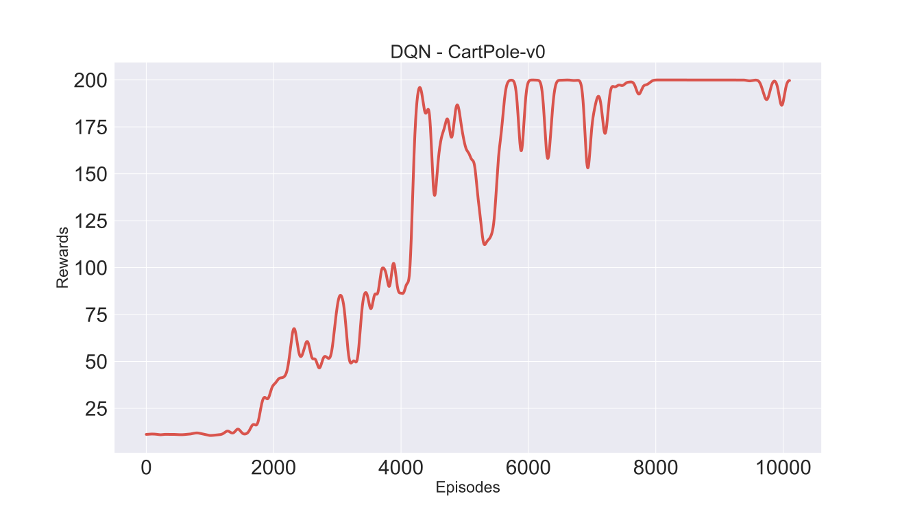

# DQN

## Cart Pole: 

Further details on the CartPole environment: https://gym.openai.com/envs/CartPole-v1/

**Train Command**:

python main.py --train --cuda

The training curve below was smoothened since the original curve is very noisy

**Test Command**:

python main.py --test --cuda

