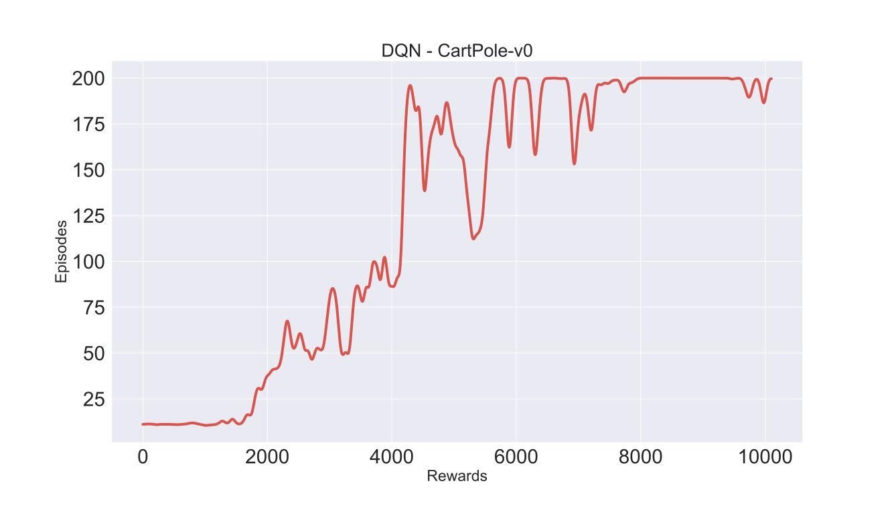

# Deep-Reinforcement-Learning
This repo goes hand in hand with the course I am doing on YouTube on Deep Reinforcement Learning

This repository compliments the youtube Deep Reinforcement Learning series: https://www.youtube.com/watch?v=gTNNXi9ApVU

The algrithms this repository contains (so far..):
1. DQN - Video: DRL - Part 2 (https://youtu.be/4Xj3la71dB0) 

### Pre-requisites:
(best to download Anaconda and then create a virtual environment containing atleast the following:)
* PyTorch
* Open AI Gym
* Numpy
* Scipy

### DQN:
The algorithm is so far tested on cartpole, I'll be adding some minor change, soon as the ensuing video is going to be applying it on Atari game.

